```
nt!KeBugCheckEx
nt!guard_icall_handler
nt!RtlpExecuteHandlerForException
nt!RtlDispatchException
nt!KiDispatchException
nt!KiExceptionDispatch
nt!KiGeneralProtectionFault
nt!KscpCfgDispatchUserCallTargetEsSmep+0x11 -> #GP蓝屏
xxx
xxx
xxx
```

近期遇到一个蓝屏,涉及到Windows 24H2新增的CFG保护特性。


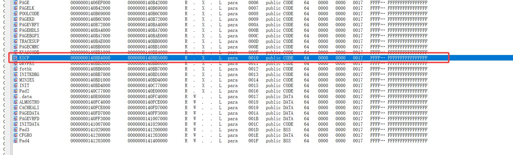

内核里现在多了一个KSCP节。

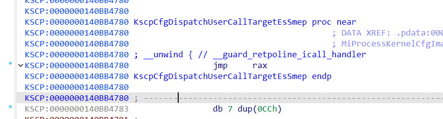


这种间接调用，编译器在编译的时候，会给他生成这种call <一个检查调用地址是否合法的函数>

用ida静态看是**_guard_dispatch_icall_no_overrides**，动态看其实是**KscpCfgDispatchUserCallTargetEsSmep**


但是如果是call KscpCfgDispatchUserCallTargetEsSmep

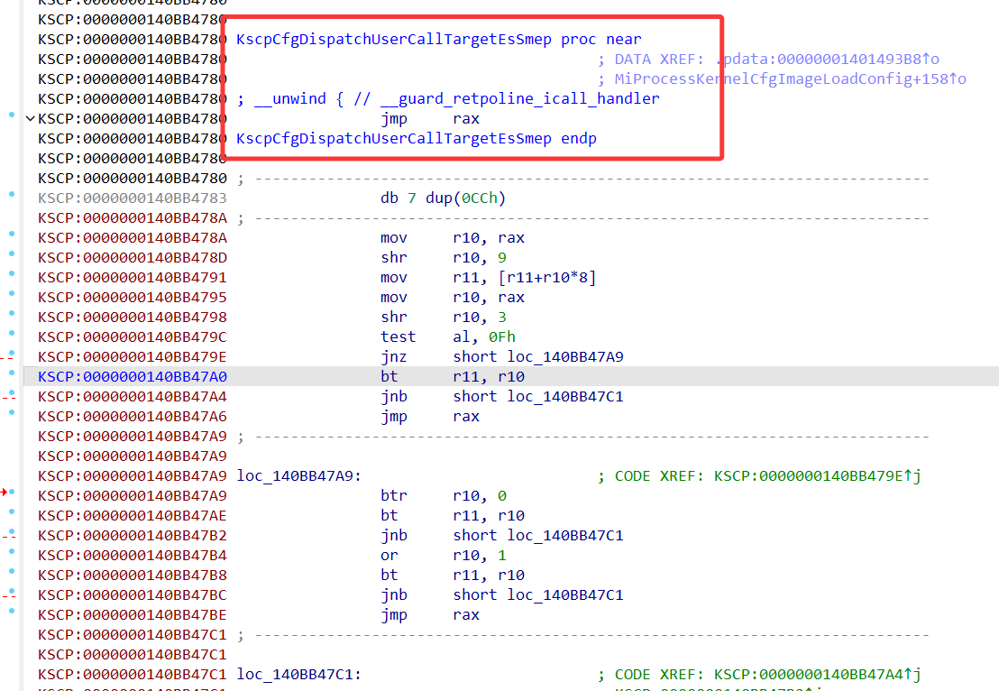

这直接jmp rax,啥也没校验，说明我的环境没有开启内核kscp这个功能。

我顺便检查了_guard_icall_bitmap这个变量，发现是0，说明确实没有开启。

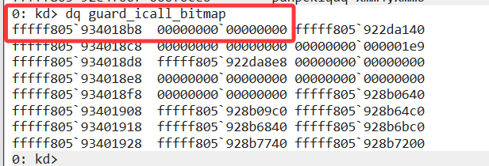


```
MiInitializeKernelCfg:
	...
    mov     rcx, 0FC00020000000000h
    add     rcx, cs:qword_140E2D518
    mov     cs:_guard_icall_bitmap, rcx   ; 这里初始化这个位图
    ...
```


参考链接2提到，开启内核cfg需要开启基于虚拟化的安全性。

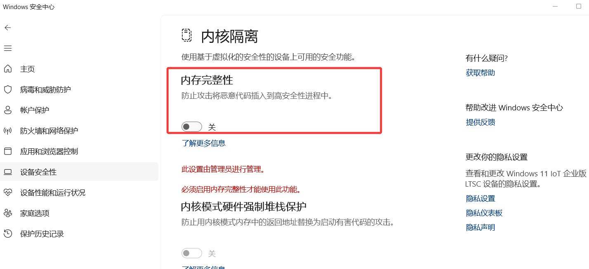

把这个开关打开，然后重启。

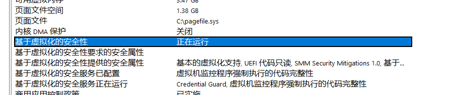

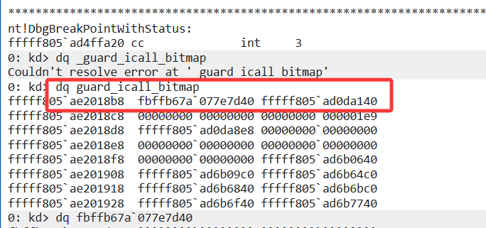

可以看到内核cfg已经初始化了。

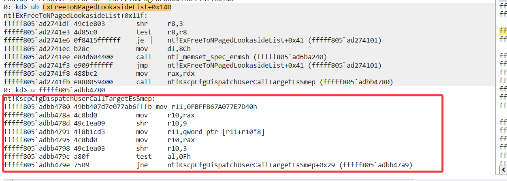

可以看到KscpCfgDispatchUserCallTargetEsSmep不是简单的jmp rax了。

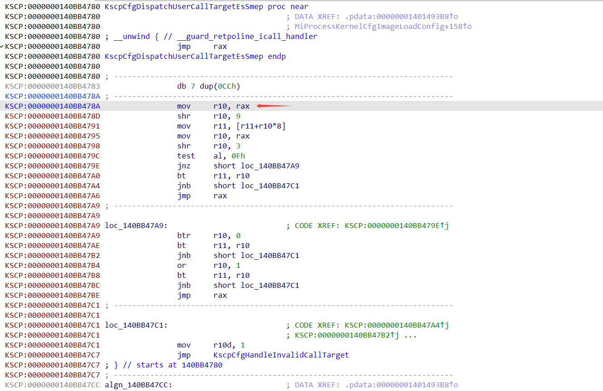

其实指向这里了，开始利用位图来校验跳转地址了。

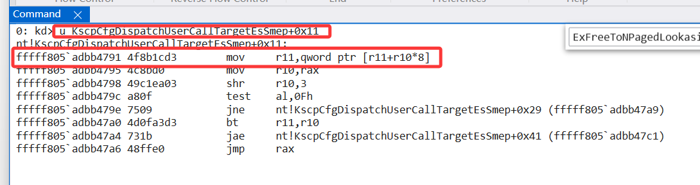

导致蓝屏的地址在0x11偏移，说明是访问内存导致的#GP。

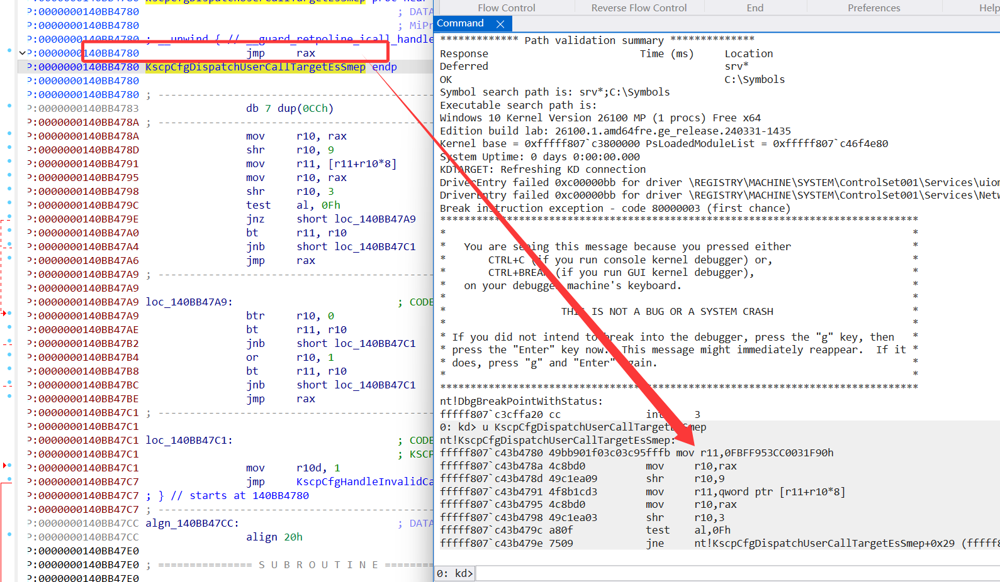

r11是固定的，

```
? 0FBFF953CC0031F90h+(<r10,要跳转的函数地址> >> 9)*8
```


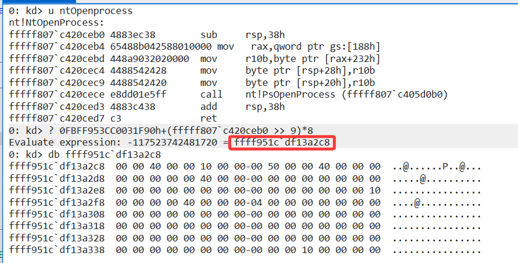

如果跳转的地址正确，最终是不会导致访问异常。


如果跳转的地址不对，也就是函数指针值本来就无法访问，最终算出来的地址也访问不了，导致#GP。

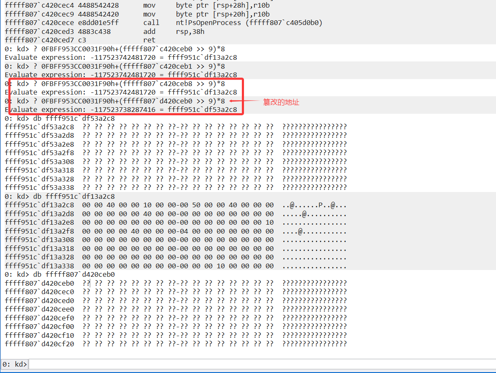


**总结:**

说明不是因为新特性导致的蓝屏，而是原来的代码就有问题，传的函数指针地址不对。


**参考**

1. https://ynwarcs.github.io/Win11-24H2-CFG
2. https://community.osr.com/t/control-flow-guard-question/53940/3