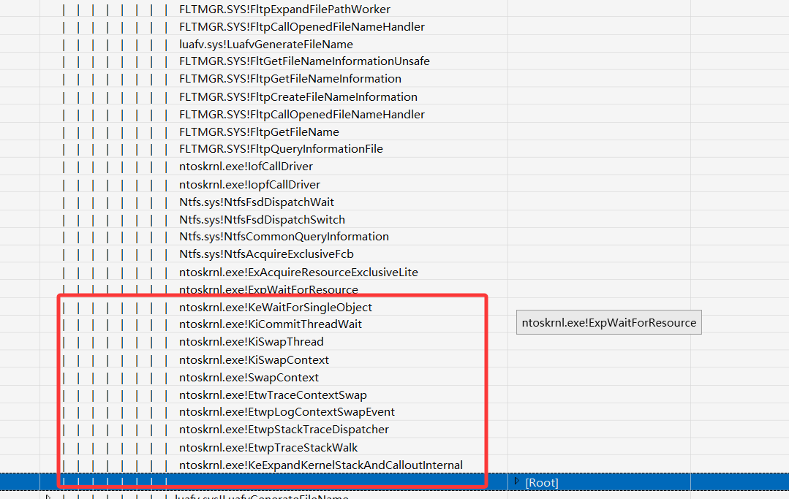
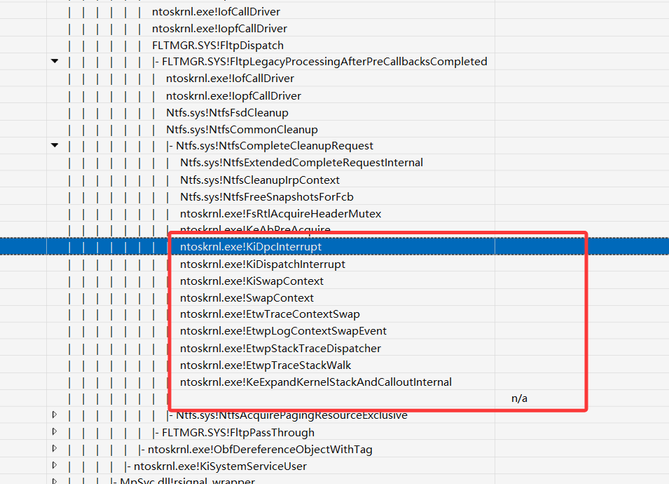
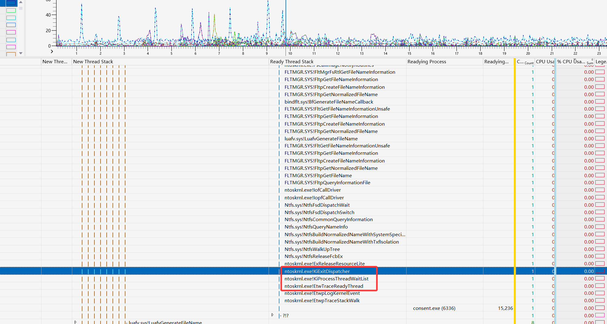

本文通过看reactos源码、已有博客和逆向工程学习Windows线程切换相关原理。


```c
enum _KTHREAD_STATE
{
    Initialized = 0,
    Ready = 1,
    Running = 2,
    Standby = 3,
    Terminated = 4,
    Waiting = 5,
    Transition = 6,
    DeferredReady = 7,
    GateWaitObsolete = 8,
    WaitingForProcessInSwap = 9
}; 
```

上面是线程的几种状态。




```c
NTSTATUS __stdcall KeWaitForSingleObject(
        PVOID Object,
        KWAIT_REASON WaitReason,
        KPROCESSOR_MODE WaitMode,
        BOOLEAN Alertable,
        PLARGE_INTEGER Timeout)
{
	...
    if (CurrentObject->Header.Type == MutantObject)
    {
    /* Check its signal state or if we own it */
    if ((CurrentObject->Header.SignalState > 0) ||
    (Thread == CurrentObject->OwnerThread))
    {
    /* Just unwait this guy and exit */
    if (CurrentObject->Header.SignalState != MINLONG)
    {
    /* It has a normal signal state. Unwait and return */
    KiSatisfyMutantWait(CurrentObject, Thread);
    WaitStatus = (NTSTATUS)Thread->WaitStatus;
    goto DontWait;
    }
    else
    {
    /* Raise an exception */
    KiReleaseDispatcherLock(Thread->WaitIrql);
    ExRaiseStatus(STATUS_MUTANT_LIMIT_EXCEEDED);
    }
    }
    }
    else if (CurrentObject->Header.SignalState > 0) // 这个Object对象触发了吗,如果被Set了就不用等了
    {
    /* Another satisfied object */
    KiSatisfyNonMutantWait(CurrentObject);
    WaitStatus = STATUS_WAIT_0;
    goto DontWait;
    }
	...
	
    if (Timeout) // 再判断这个超时时间
    {
    /* Check if the timer expired */
    InterruptTime.QuadPart = KeQueryInterruptTime();
    if ((ULONGLONG)InterruptTime.QuadPart >=
    Timer->DueTime.QuadPart)
    {
    /* It did, so we don't need to wait */
    WaitStatus = STATUS_TIMEOUT;
    goto DontWait;  // 超时了直接走
    }

    /* It didn't, so activate it */
    Timer->Header.Inserted = TRUE;
    }
    
    // 把当前线程插入到那个Object的等待列表中,这样下一次比如SetEvent的时候就知道唤醒哪些线程了
    InsertTailList(&CurrentObject->Header.WaitListHead,
                           &WaitBlock->WaitListEntry);
    
    Thread->State = Waiting; // 设置线程状态
    
    KiAddThreadToWaitList(Thread, Swappable); // 把这个线程加入到当前prcb中的WaitListHead
    
    // 最新的nt内核里是KiCommitThreadWait,相当于在KiSwapThread上面封装了一层
	WaitStatus = (NTSTATUS)KiSwapThread(Thread, KeGetCurrentPrcb()); // 调用这个线程执行线程切换
	

}
```


```
__int64 __fastcall KiSwapThread(_KTHREAD *Thread, _KPRCB *Proc, void *volatile *a3){
	...
	if ( Proc->DeferredReadyListHead.Next )  
    	KiProcessThreadWaitList(Proc, 1u, 0, 2u);
    
    ...

}
```


```
__int64 __fastcall KiProcessThreadWaitList(_KPRCB *a1, char a2, char a3, char a4){
	

}
```


上面是发生主动等待触发线程切换，还有一种是线程时间片到期被迫发生线程切换。



```
d1: fffff801fc1d66d8 hal!HalpTimerClockInterrupt (KINTERRUPT fffff801fc0633e0)
```

```
char __fastcall HalpTimerClockInterrupt(__int64 a1){
	...
	KeClockInterruptNotify(v1, v2, 0i64); // 我猜应该是时钟中断触发，然后因为不能长时间执行，后面搞了个DPC软件中断，去执行线程切换
	...
}
```


我发现了一个现象，在etl中，如果线程是被迫切换的，没有Ready Thread Stack,如果是主动切换的，有Ready Thread Stack。


Gemini的回答不错。

```
LONG __stdcall KeSetEvent(PRKEVENT Event, KPRIORITY Increment, BOOLEAN Wait){
	...
    p_WaitListHead = &Event->Header.WaitListHead; // 拿到等待这个对象的线程列表，逐一唤醒
    KiTryUnwaitThread(CurrentPrcb, v15, 256i64, 0i64); // 唤醒线程
    KiExitDispatcher(CurrentPrcb, v4 != 0 ? 3 : 0, 1, Increment, v48); // 记录唤醒者的信息,这里就是etw那一行信息的来源了
	...
}
```



**参考:**

https://www.vergiliusproject.com/kernels/x64/windows-11/25h2

https://book.douban.com/annotation/28891472/